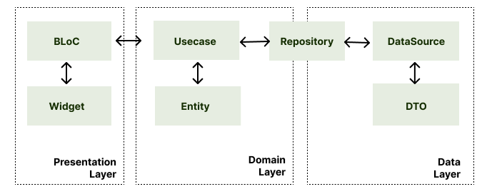

[Flutter] WithU
---
프리랜서와 다양한 직종의 업체를 연결해주는 소셜 매칭 플랫폼

* 단순한 기능 개발을 넘어, 코드의 재사용성과 유지보수성을 최우선으로 고려한 체계적인 설계를 지향합니다.
* BLoC 패턴과 클린 아키텍처를 적용해 유연하고 확장 가능한 구조를 구축하는 것을 목표로 합니다.

### Installing
1. 프로젝트 clone
```
git clone https://github.com/f-lab-edu/flutter-withu.git
cd flutter-withu
```
2. 패키지 설치
```
flutter pub get
```
3. 코드 생성
```
flutter pub run build_runner build
```
4. 플러터 실행
- 플러터 실행시 `core/config/env/` 폴더의 `dev.dart`, `prod.dart`를 실행

### 프로젝트 사용 기술

* Flutter, Dart
* State Manegement : flutter_bloc
* Navigation: auto_route
* DI : get_it
* REST API: dio
* Data class: freezed
* Script manager: derry
* Resource manager: flutter_gen
* Lint: flutter_lint

### Architecture

BLoC 패턴 + 클린 아키텍처 적용



### 주요 기능

<details>


<summary>공고 관리 기능 </summary>

### 공고 관리 기능

1. 공고 목록
    1. 상태별 공고 목록을 볼 수 있는 화면
        - 상태 : `임시저장`, `진행`, `마감`
        - 검색 기능(공고명을 통한 검색)
2. 주소 찾기
    - 웹뷰와 다음 Post API를 활용한 주소 검색 기능
3. `Picker` 를 통한 기간 설정 기능
    - datepicker를 이용한 기간 설정 기능
    - timepicker를 이용한 시간 선택 기능
4. 지도 기능
    - 네이버 API를 활용한 지도 표시 기능
    - 공고의 등록된 주소를 마커로 표시
5. 공고 상세
    - 등록된 공고의 정보 표시
    - 4번 기능 활용한 지도 표시
6. 공고 등록
    - 등록 시 필요한 입력 항목
        - 공고명, 근로내용, 카테고리, 모집인원, 급여방법
        - 이동시간 유무, 휴게시간 유무, 식비유무, 근로계약기간, 주소
    - 근로계약기간
        - datepicker를 이용한 근로 기간 선택
        - timepicker를 이용한 근로 시간 선택
    - 주소
        - 주소 찾기 버튼 클릭 시 주소 찾기 화면으로 이동
7. 공고 임시 저장
8. 공고 마감
9. 공고 삭제
10. 공고 수정
    - 등록과 필요한 항목이 동일
11. 공고 지원자 목록
    - 해당 공고의 지원한 지원자 목록
    - 긱워커의 출근, 퇴근 정보 표시
    - 공고보기 버튼을 통해 공고 상세화면으로 이동

</details>

<details>
<summary>로그인/회원가입 기능</summary>

### 로그인/회원가입 기능

1. 로그인
   - 로그인 타입으로 사업자(긱워커찾기), 근로자(새로운 일 찾기)을 선택
   - 아이디, 비밀번호를 입력
   - 비밀번호는 암호화되어 표시
   - 비밀번호 우측 버튼을 통해 입력한 비밀번호를 확인 가능
   - 이메일 입력시 입력된 이메일의 형식을 검사
   - 비밀번호는 8자리 이상 입력되었는지 검사
   - 로그인 성공 시 공고 목록 화면으로 이동
2. 회원가입
   - 이름, 생년월일, 성별, 휴대폰 번호, 이메일, 비밀번호 필수 입력값
   - 휴대폰 번호 인증 기능
   - 이메일 중복 검사
   - 비밀번호 암호화하여 표시
   - 암호화된 비밀번호 확인 기능 제공
   - 회원가입 성공 시 로그인 화면으로 이동
3. 아이디 찾기
   - 휴대폰 번호 인증을 통한 아이디 찾기 기능
   - 아이디 찾기 성공시 성공 화면 표시
   - 아이디 찾기 실패시 실패 화면 표시
4. 비밀번호 찾기
   - 아이디, 휴대폰 번호 인증을 통한 본인인증
   - 본인 인증 성공 시 비밀번호 재설정
   - 본인 인증 실패 시 실패 문구 표시
   - 가입된 계정이 없을 경우 안내 문구 표시
   - 비밀번호 재설정 완료 후 로그인 화면으로 이동

</details>

<details>
<summary>일정 관리 기능</summary>

### 일정 관리 기능

1. 일정 달력 기능
    - 달력을 통한 등록된 일정 표시 기능
    - 필터링 기능
        - 내일정 + 공고일정 표시
        - 공고일정만 표시
2. 일정 목록
    - 특정 날짜의 등록된 일정 리스트 표시
    - 공고 일정 클릭 시 공고 상세로 이동
    - 내 일정 클릭 시 내 일정 상세 화면으로 이동
3. 내 일정 등록
    - 제목, 날짜, 시간, 카테고리, 반복 여부, 메모 작성
    - 날짜 선택 - datepicker 활용
    - 시간 선택 - timepicker 활용
    - 카테고리 선택 - dropdown 메뉴 활용
4. 카테고리 관리
    - 바텀 시트를 통한 카테고리 목록 표시
5. 카테고리 추가
    - 바텀 시트를 통한 카테고리 추가 기능
6. 내 일정 상세
7. 내 일정 수정
8. 내 일정 삭제

</details>

### UI

[Figma 링크](https://www.figma.com/design/pEvpVIZU5Oci8l4kgOhM9s/with-U?node-id=632-29202&t=ZjVi5Xy4BKJCzdDb-1)

Figma - 디자인2차 - 회사 - 홈, 달력 영역에서 UI를 확인하실 수 있습니다.

### 기술적 이슈, 해결 과정

프로젝트를 진행하며 작성할 예정입니다.

### 참고문헌

* [(Flutter) Clean Architecture 적용해보기 ](https://blog.arong.info/flutter/2023/11/29/Flutter-Clean-Architecture-%EC%A0%81%EC%9A%A9%ED%95%B4%EB%B3%B4%EA%B8%B0.html)
* [Clean Architecture in Flutter | MVVM | BloC | Dio](https://medium.com/@yamen.abd98/clean-architecture-in-flutter-mvvm-bloc-dio-79b1615530e1)
